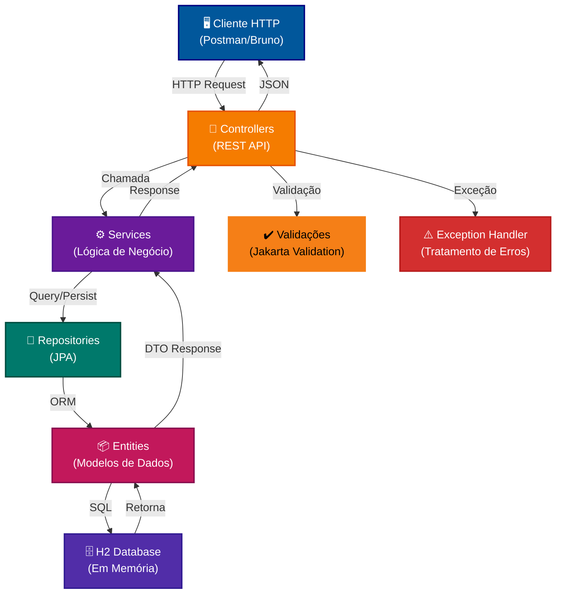
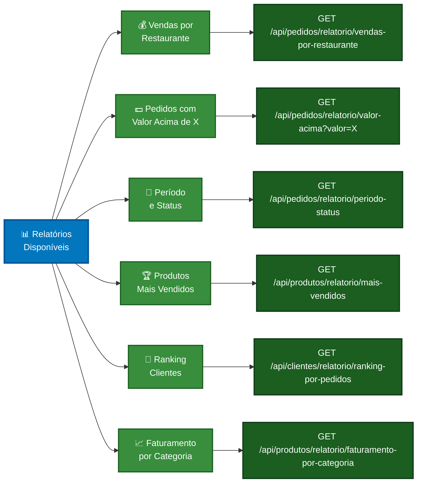

# 🚀 Delivery Tech API


Sistema de delivery desenvolvido com **Spring Boot 3.4.11** e **Java 21 LTS**, utilizando as mais modernas features de desenvolvimento backend.

**[📖 Guia de Testes Manuais](./Docs/INDEX_DOCUMENTACAO.md)** | **[🎯 Collection Postman](./Docs/delivery-api-postman.json)** | **[🖥️ H2 Console](http://localhost:8080/h2-console)**

---

## 🛠️ Tecnologias Utilizadas

### Stack Principal
| Tecnologia | Versão | Descrição |
|-----------|--------|-----------|
| **Java** | 21 LTS | Linguagem principal, recursos modernos (Records, Text Blocks, Pattern Matching, Virtual Threads) |
| **Spring Boot** | 3.4.11 | Framework web e dependência |
| **Spring Data JPA** | - | Persistência e acesso a dados com ORM |
| **Spring Web** | - | REST API e tratamento HTTP |
| **H2 Database** | - | Banco de dados em memória para desenvolvimento |
| **Maven** | 3.6+ | Gerenciador de dependências e build |
| **Logback** | - | Sistema de logging com rotação automática |

### Recursos Modernos do Java 21
```
✓ Records (Java 14+)            - Imutabilidade de dados com sintaxe simplificada
✓ Text Blocks (Java 15+)        - Strings multi-linha para JSON e SQL
✓ Pattern Matching (Java 17+)   - Verificação de tipos simplificada
✓ Virtual Threads (Java 21)     - Threads leves para melhor performance
✓ Sealed Classes (Java 17+)     - Controle de herança de classes
✓ Switch Expression (Java 14+)  - Switch como expressão retornando valor
```

---

## 📊 Arquitetura da Aplicação



---

## 🎯 Endpoints Organizados por Controller

### 🏥 Health & Info Controller
Status e informações da aplicação

| Método | Endpoint | Descrição | Status |
|--------|----------|-----------|--------|
| `GET` | `/health` | Status da aplicação (Java version, service UP/DOWN) | 200 |
| `GET` | `/info` | Informações da app e desenvolvedor | 200 |
| `GET` | `/h2-console` | Console do banco H2 | 200 |

**Exemplo cURL:**
```bash
curl -X GET "http://localhost:8080/health"
```

---

### 👥 Cliente Controller
Gerenciamento de clientes do sistema

#### Criar Cliente
```http
POST /api/clientes
Content-Type: application/json

{
  "nome": "João Silva",
  "email": "joao@email.com",
  "telefone": "11987654321",
  "cpf": "12345678901",
  "ativo": true
}
```
**Resposta:** 201 Created  
**Validações:** Email, CPF, Nome, Telefone

#### Consultar Clientes
| Método | Endpoint | Descrição | Query |
|--------|----------|-----------|-------|
| `GET` | `/api/clientes/email/{email}` | Buscar por email | - |
| `GET` | `/api/clientes/nome` | Buscar por nome (parcial) | `?nome=João` |
| `GET` | `/api/clientes/ativo` | Primeiro cliente ativo | - |
| `GET` | `/api/clientes/existe-email/{email}` | Verificar email | - |

#### Relatório
| Método | Endpoint | Descrição | Retorno |
|--------|----------|-----------|---------|
| `GET` | `/api/clientes/relatorio/ranking-por-pedidos` | Ranking clientes por nº de pedidos | JSON Array |

---

### 🏪 Restaurante Controller
Gerenciamento de restaurantes com **ciclo completo** (CRUD + Relatórios)

#### CRUD Completo

| Método | Endpoint | Descrição | Status |
|--------|----------|-----------|--------|
| `GET` | `/api/restaurantes` | Listar com filtros | ✅ |
| `POST` | `/api/restaurantes` | Criar | ✅ |
| `GET` | `/api/restaurantes/{id}` | Obter por ID | ✅ |
| `PUT` | `/api/restaurantes/{id}` | Atualizar completo | ✅ |
| `PATCH` | `/api/restaurantes/{id}/status` | Ativar/desativar | ✅ |

#### Criar Restaurante
```http
POST /api/restaurantes
Content-Type: application/json

{
  "nome": "Pizza Palace",
  "endereco": "Avenida Paulista, 1000",
  "telefone": "1133334444",
  "cnpj": "11222333000181",
  "ramoAtividade": "Pizzaria",
  "ativo": true,
  "taxaEntrega": 5.00
}
```
**Resposta:** 201 Created  
**Validações:** CNPJ, Nome, Telefone, Taxa não-negativa

#### Consultar Restaurantes
| Método | Endpoint | Descrição | Query |
|--------|----------|-----------|-------|
| `GET` | `/api/restaurantes` | Listar com filtros | `?ramo=Pizzaria&ativo=true` |
| `GET` | `/api/restaurantes/{id}` | Buscar por ID | - |
| `GET` | `/api/restaurantes/categoria/{categoria}` | Por categoria | - |

#### Atualizar Restaurante
```http
PUT /api/restaurantes/{id}
Content-Type: application/json

{
  "nome": "Pizza Palace Premium",
  "endereco": "Avenida Paulista, 2000",
  "telefone": "1133334445",
  "cnpj": "11222333000181",
  "ramoAtividade": "Pizzaria Premium",
  "ativo": true,
  "taxaEntrega": 7.50
}
```
**Resposta:** 200 OK

#### Ativar/Desativar (PATCH)
```http
PATCH /api/restaurantes/{id}/status
Content-Type: application/json

{
  "ativo": false
}
```
**Resposta:** 200 OK

#### Relatórios & Cálculos 📊
| Método | Endpoint | Descrição | Query |
|--------|----------|-----------|-------|
| `GET` | `/api/restaurantes/{id}/taxa-entrega/{cep}` | Calcular taxa | - |
| `GET` | `/api/restaurantes/proximos/{cep}` | Restaurantes próximos | `?raio=10` |

**Exemplo - Calcular taxa:**
```bash
GET /api/restaurantes/1/taxa-entrega/90010100
```
Retorna distância e taxa calculadas para o CEP

**Exemplo - Restaurantes próximos:**
```bash
GET /api/restaurantes/proximos/90010100?raio=5
```
Retorna restaurantes ativos dentro do raio (km), ordenados por distância

📖 **[Documentação Completa dos Endpoints →](./Docs/ENDPOINTS_RESTAURANTE.md)**

---

### 🍕 Produto Controller
Gerenciamento de produtos

#### Criar Produto
```http
POST /api/produtos
Content-Type: application/json

{
  "nome": "Pizza Margherita",
  "descricao": "Pizza clássica com tomate, mozzarela e manjericão",
  "preco": 45.00,
  "disponivel": true,
  "categoria": "Pizzas"
}
```
**Resposta:** 201 Created  
**Validações:** Preço > 0, Nome, Descrição, Categoria

#### Consultar Produtos
| Método | Endpoint | Descrição | Query |
|--------|----------|-----------|-------|
| `GET` | `/api/produtos/restaurante/{id}` | Produtos de um restaurante | - |
| `GET` | `/api/produtos/disponivel` | Produtos disponíveis | - |
| `GET` | `/api/produtos/categoria/{categoria}` | Produtos por categoria | - |
| `GET` | `/api/produtos/preco-maximo` | Filtrar por preço máximo | `?preco=50.00` |

#### Relatórios 📊
| Método | Endpoint | Descrição | Retorno |
|--------|----------|-----------|---------|
| `GET` | `/api/produtos/relatorio/mais-vendidos` | TOP produtos por quantidade | JSON Array |
| `GET` | `/api/produtos/relatorio/faturamento-por-categoria` | Faturamento por tipo | JSON Array |

---

### 📦 Pedido Controller
Gerenciamento de pedidos (CRUD + Relatórios)

#### Criar Pedido
```http
POST /api/pedidos
Content-Type: application/json

{
  "numeroPedido": "PEDIDO-001",
  "status": "PENDENTE",
  "clienteId": 1,
  "restauranteId": 1,
  "itens": [
    {
      "produtoId": 1,
      "quantidade": 2,
      "precoUnitario": 45.00
    }
  ]
}
```
**Resposta:** 201 Created  
**Validações:** Número único, Status (PENDENTE|ENTREGUE|CANCELADO), Mínimo 1 item, Quantidade > 0

#### Consultar Pedidos
| Método | Endpoint | Descrição | Query |
|--------|----------|-----------|-------|
| `GET` | `/api/pedidos/cliente/{clienteId}` | Pedidos de um cliente | - |
| `GET` | `/api/pedidos/status/{status}` | Pedidos por status | - |
| `GET` | `/api/pedidos/top-10-maiores` | Top 10 maiores pedidos | - |
| `GET` | `/api/pedidos/data-range` | Pedidos em período | `?dataInicial=2025-01-01T00:00:00&dataFinal=2025-12-31T23:59:59` |
| `GET` | `/api/pedidos/restaurante/{id}/top-5` | Top 5 pedidos de restaurante | - |

#### Relatórios 📊
| Método | Endpoint | Descrição | Retorno | Query |
|--------|----------|-----------|---------|-------|
| `GET` | `/api/pedidos/relatorio/vendas-por-restaurante` | Total de vendas agrupado | JSON Array | - |
| `GET` | `/api/pedidos/relatorio/valor-acima` | Pedidos com valor mínimo | JSON Array | `?valor=100` |
| `GET` | `/api/pedidos/relatorio/periodo-status` | Filtro período + status | JSON Array | `?dataInicial=...&dataFinal=...&status=ENTREGUE` |

---

## ✔️ Validações Implementadas

### Validações de Campo

#### Cliente
```json
{
  "nome": {
    "obrigatório": true,
    "tamanho": "3-50 caracteres",
    "regra": "Não pode ser vazio"
  },
  "email": {
    "obrigatório": true,
    "tamanho": "até 50 caracteres",
    "regra": "Formato válido + Unique"
  },
  "cpf": {
    "obrigatório": true,
    "formato": "11 dígitos",
    "regra": "CPF válido + Unique"
  },
  "telefone": {
    "obrigatório": true,
    "tamanho": "10-15 caracteres",
    "regra": "Aceita dígitos e formatação"
  },
  "ativo": {
    "obrigatório": true,
    "tipo": "Boolean"
  }
}
```

#### Restaurante
```json
{
  "nome": {
    "obrigatório": true,
    "tamanho": "3-100 caracteres",
    "regra": "Unique"
  },
  "endereco": {
    "obrigatório": true,
    "tamanho": "5-255 caracteres"
  },
  "cnpj": {
    "obrigatório": true,
    "formato": "14 dígitos",
    "regra": "CNPJ válido + Unique"
  },
  "taxaEntrega": {
    "obrigatório": true,
    "regra": "Não pode ser negativa"
  }
}
```

#### Produto
```json
{
  "nome": {
    "obrigatório": true,
    "tamanho": "3-100 caracteres"
  },
  "preco": {
    "obrigatório": true,
    "regra": "Maior que 0"
  },
  "categoria": {
    "obrigatório": true,
    "tamanho": "3-20 caracteres"
  }
}
```

#### Pedido
```json
{
  "numeroPedido": {
    "obrigatório": true,
    "padrão": "^[A-Z0-9-]+$",
    "tamanho": "5-20 caracteres"
  },
  "status": {
    "obrigatório": true,
    "valores": ["PENDENTE", "ENTREGUE", "CANCELADO"]
  },
  "itens": {
    "obrigatório": true,
    "regra": "Mínimo 1 item"
  }
}
```

### Validadores Customizados
- `@UniqueCpf` - Valida CPF único
- `@UniqueEmail` - Valida email único
- `@UniqueCnpj` - Valida CNPJ único
- `@UniqueNomeRestaurante` - Valida nome único
- `@UniqueTelefoneRestaurante` - Valida telefone único

---

## 📊 Relatórios Disponíveis



### Exemplos de Resposta dos Relatórios

#### 1. Vendas por Restaurante
```json
[
  {
    "restauranteId": 1,
    "nomeRestaurante": "Pizza Palace",
    "totalVendas": 343.00
  }
]
```

#### 2. Produtos Mais Vendidos
```json
[
  {
    "produtoId": 1,
    "nomeProduto": "Pizza Margherita",
    "totalVendido": 15,
    "categoria": "Pizzas"
  }
]
```

#### 3. Ranking de Clientes
```json
[
  {
    "clienteId": 1,
    "nomeCliente": "João Silva",
    "totalPedidos": 5
  }
]
```

---

## 🗂️ Estrutura do Projeto

```
src/main/java/com/deliverytech/delivery/
├── DeliveryApiApplication.java ..................... Spring Boot Main
├── config/
│   └── HttpLoggingConfig.java ..................... Logging HTTP
├── controller/
│   ├── ClienteController.java ..................... REST: Clientes
│   ├── RestauranteController.java ................. REST: Restaurantes
│   ├── ProdutoController.java ..................... REST: Produtos
│   ├── PedidoController.java ...................... REST: Pedidos
│   ├── HealthController.java ...................... Health Check
│   └── DemoController.java ........................ Java 21 Features
├── service/
│   ├── ClienteService.java ........................ Lógica: Clientes
│   ├── RestauranteService.java .................... Lógica: Restaurantes
│   ├── ProdutoService.java ........................ Lógica: Produtos
│   ├── PedidoService.java ......................... Lógica: Pedidos
│   └── impl/ ...................................... Implementações
├── repository/
│   ├── ClienteRepository.java ..................... DAO: Clientes
│   ├── RestauranteRepository.java ................. DAO: Restaurantes
│   ├── ProdutoRepository.java ..................... DAO: Produtos
│   └── PedidoRepository.java ...................... DAO: Pedidos
├── entity/
│   ├── Cliente.java .............................. Modelo: Cliente
│   ├── Restaurante.java ........................... Modelo: Restaurante
│   ├── Produto.java .............................. Modelo: Produto
│   ├── Pedido.java ............................... Modelo: Pedido
│   └── PedidoProduto.java ......................... Modelo: Relacionamento
├── dto/
│   ├── request/
│   │   ├── ClienteRequest.java
│   │   ├── RestauranteRequest.java
│   │   ├── ProdutoRequest.java
│   │   └── PedidoRequest.java
│   └── response/
│       ├── ClienteResponse.java
│       ├── RestauranteResponse.java
│       ├── ProdutoResponse.java
│       ├── PedidoResponse.java
│       └── (response objects)
├── validation/
│   ├── UniqueCpf.java ............................. Validador: CPF Único
│   ├── UniqueEmail.java ........................... Validador: Email Único
│   ├── UniqueCnpj.java ............................ Validador: CNPJ Único
│   └── (outros validadores)
└── exception/
    ├── GlobalExceptionHandler.java ............... Tratamento Global de Erros
    └── ApiErrorResponse.java ..................... Formato de Erro
```

---

## 🚀 Como Executar

### Pré-requisitos
- **JDK 21+** instalado
- **Maven 3.6+** instalado

### Passos

1. **Clone o repositório**
```bash
git clone https://github.com/rrublez/delivery-api-rrubleske.git
cd delivery-api-rrubleske
```

2. **Execute a aplicação**
```bash
./mvnw spring-boot:run
```

3. **Verifique se está rodando**
```bash
curl http://localhost:8080/health
```

4. **Acesse os consoles**
- H2 Console: http://localhost:8080/h2-console (user: sa, senha vazia)
- Health: http://localhost:8080/health

---

## ⚙️ Configuração

| Config | Valor | Descrição |
|--------|-------|-----------|
| **Porta** | 8080 | Porta padrão |
| **Banco** | H2 em memória | Recriadoao iniciar |
| **Profile** | development | Ambiente de desenvolvimento |
| **Hibernate DDL** | update | Cria/atualiza tabelas |
| **Logs** | logs/app.log | Arquivo de log com rotação |

### Arquivo: `application.properties`
```properties
server.port=8080
spring.datasource.url=jdbc:h2:file:./data/deliverydb
spring.jpa.hibernate.ddl-auto=update
spring.jpa.show-sql=true
```

---

## 📝 Logging

A aplicação utiliza **Logback** com as seguintes características:

✓ **Console:** Logs coloridos em tempo real  
✓ **Arquivo:** Salvo em `logs/app.log`  
✓ **Rotação:** 1MB por arquivo, máximo 2 dias  
✓ **HTTP:** Registra método, URL, status, tempo de execução  
✓ **SQL:** DEBUG level para queries JPA  

---

## 📖 Documentação de Testes

Para documentação completa sobre **testes manuais** com exemplos e validações:

👉 **[Acessar Guia de Testes Manuais](./Docs/INDEX_DOCUMENTACAO.md)**

Inclui:
- ✅ 32 testes prontos para Postman/Bruno
- ✅ Validações com exemplos de erro
- ✅ Dados de teste inclusos
- ✅ Guia passo-a-passo

---

## 📦 Dependências Principais

```xml
<!-- Spring Boot -->
<dependency>org.springframework.boot:spring-boot-starter-web</dependency>
<dependency>org.springframework.boot:spring-boot-starter-data-jpa</dependency>

<!-- Validação -->
<dependency>jakarta.validation:jakarta.validation-api</dependency>
<dependency>org.hibernate.validator:hibernate-validator</dependency>

<!-- Banco de Dados -->
<dependency>com.h2database:h2</dependency>

<!-- Utilitários -->
<dependency>org.projectlombok:lombok</dependency>

<!-- Logging -->
<!-- Logback (vem incluído no Spring Boot) -->
```

---

**Versão:** 1.0.0  
**Java:** 21 LTS  
**Spring Boot:** 3.4.11  
**Data:** Novembro 2025

---

## 👨‍💻 Desenvolvedor

**Rafael Rubleske**  
Análise e Desenvolvimento de Sistemas - UniRitter  
📧 rubleske@gmail.com
