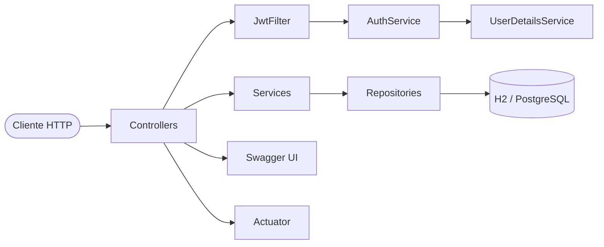
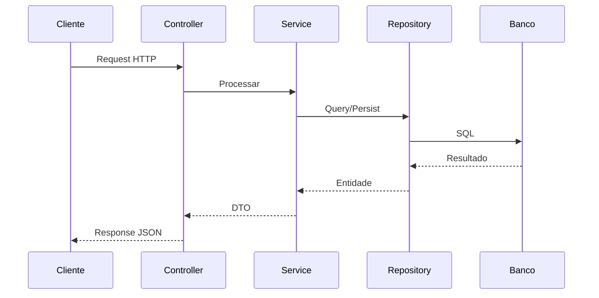
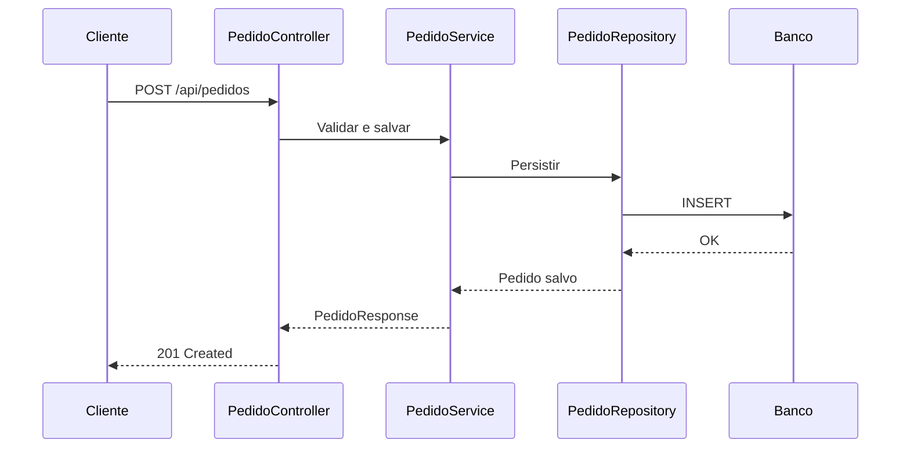
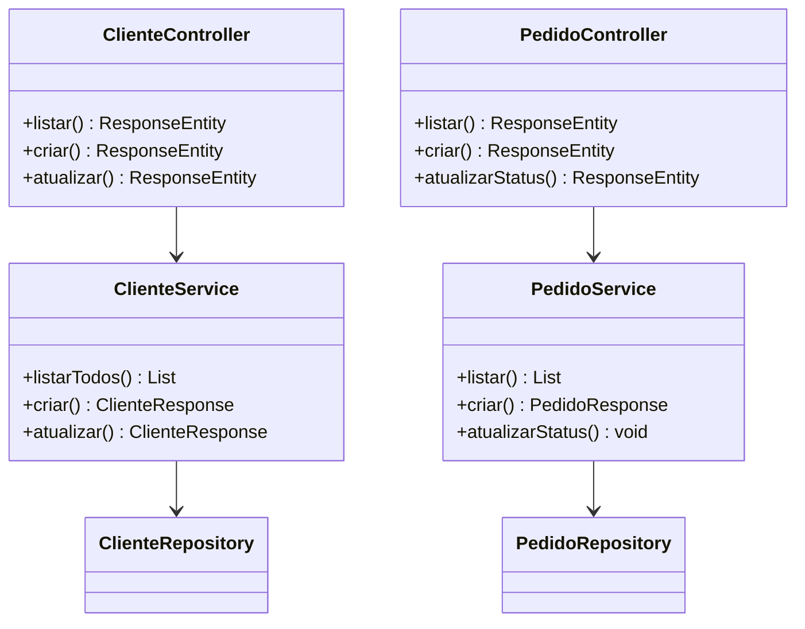
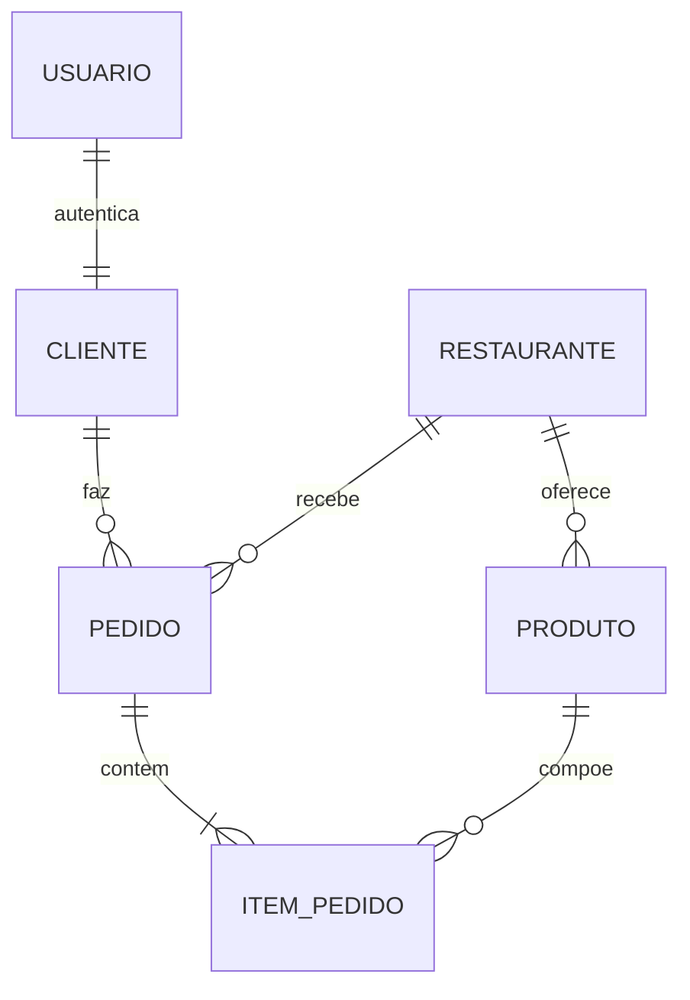

# 🚀 Delivery Tech API


API REST de delivery desenvolvida com **Spring Boot 3.4.11** e **Java 21**, testes automatizados (JUnit 5, Mockito, Cucumber) e deploy-ready para Docker/Kubernetes.

---

## 🧱 Tecnologias

| Camada | Stack |
|--------|-------|
| **Backend** | Spring Boot 3.4.11, Spring MVC, Spring Security (JWT), Spring Data JPA |
| **Banco** | H2 (dev/test), PostgreSQL (prod) |
| **Testes** | JUnit 5, Mockito, Cucumber, JaCoCo |
| **Infra** | Docker, Kubernetes, Logback |
| **Docs** | springdoc-openapi (Swagger UI) |

---

## ▶️ Executar

```bash
# Compilar e rodar
mvn clean package
java -jar target/delivery-api-1.0.0.jar

# Ou via Maven wrapper
./mvnw spring-boot:run
```

- **Swagger UI**: http://localhost:8080/swagger-ui/index.html  
- **Actuator**: http://localhost:8080/actuator/health  
- **H2 Console**: http://localhost:8080/h2-console (user: `sa`, senha vazia)

---

## ⚙️ Testes e Cobertura

```bash
mvn test
```

### Acessar relatório de cobertura

Após executar os testes, abra no navegador:

```
target/site/jacoco/index.html
```

O JaCoCo valida mínimos de **80% linhas** e **70% branches** (configurado no `pom.xml`).

---

## ☁️ Deploy (Docker + Kubernetes)

### Docker

```bash
# Build da imagem (usando GitHub Container Registry)
mvn clean package -DskipTests
docker build -t ghcr.io/rrublez/delivery-api-rrubleske:latest .
docker push ghcr.io/rrublez/delivery-api-rrubleske:latest
```

### Docker Compose (ambiente local com Postgres)

```bash
docker compose up --build
```

O `docker-compose.yml` sobe Postgres 16 + aplicação na mesma rede, com variáveis de ambiente para conexão.

### Kubernetes

```bash
kubectl apply -f k8s/delivery-api-configmap.yaml
kubectl apply -f k8s/delivery-api-secret.yaml
kubectl apply -f k8s/delivery-api-deployment.yaml
kubectl apply -f k8s/delivery-api-service.yaml
```

- **Deployment**: 2 réplicas, probes em `/actuator/health`, limites de recursos
- **Service**: LoadBalancer na porta 8080

---

## 📐 Diagramas

### Arquitetura Geral



### Fluxo de Requisição



### Fluxo de Pedido



### Diagrama de Classes



### Entidades



---

## 🔧 Configuração

| Variável | Valor Default | Descrição |
|----------|---------------|-----------|
| `SERVER_PORT` | 8080 | Porta da aplicação |
| `SPRING_DATASOURCE_URL` | jdbc:h2:mem:delivery | URL do banco |
| `SPRING_PROFILES_ACTIVE` | default | Profile ativo |

As configurações estão em `src/main/resources/application.yml`. Para produção, use os manifestos em `k8s/` ou variáveis do `docker-compose.yml`.

---

## 👨‍💻 Desenvolvedor

**Rafael Rubleske**  
Análise e Desenvolvimento de Sistemas - UniRitter  
📧 rubleske@gmail.com
