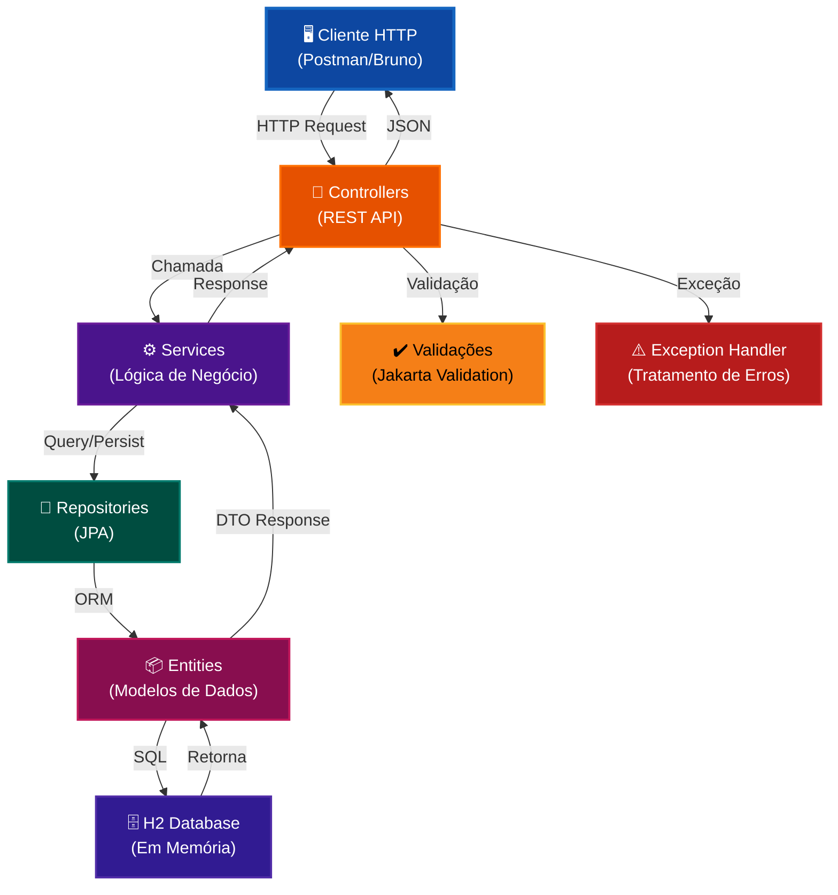
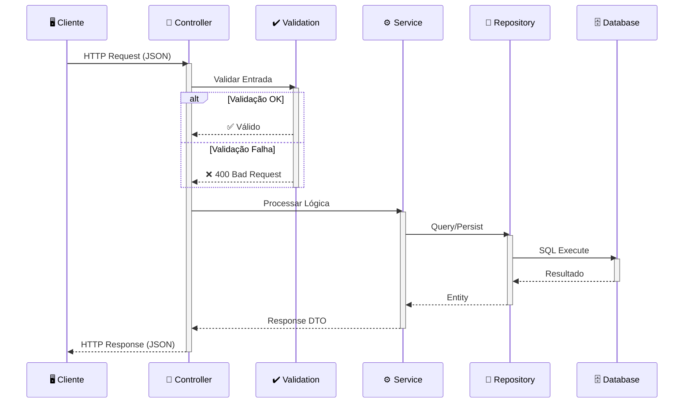
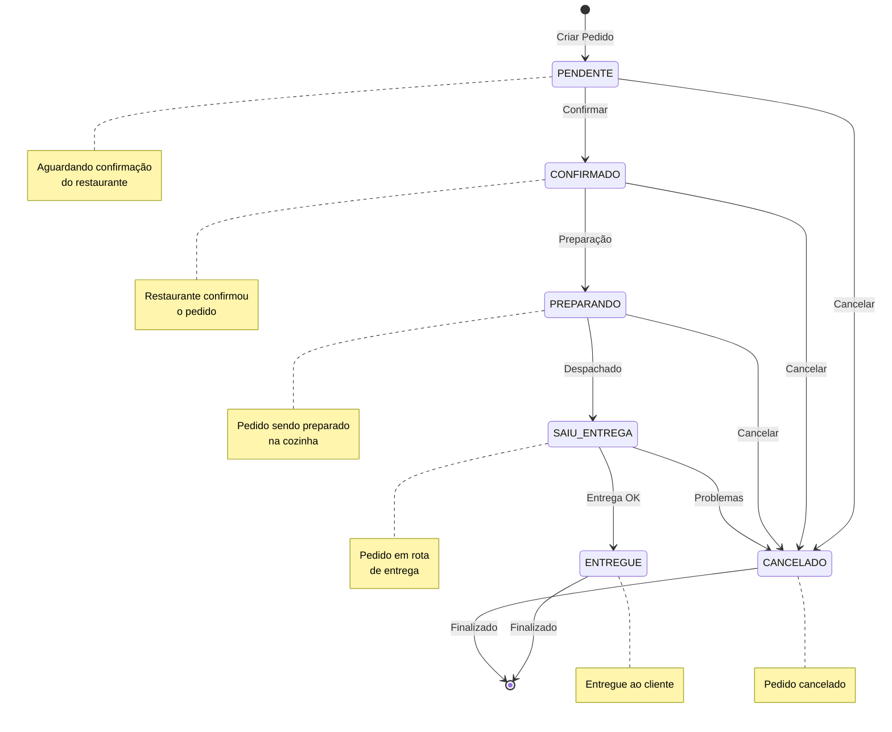
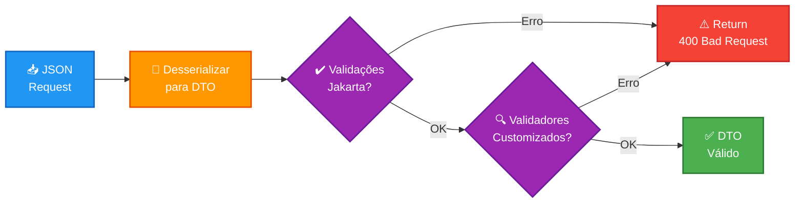
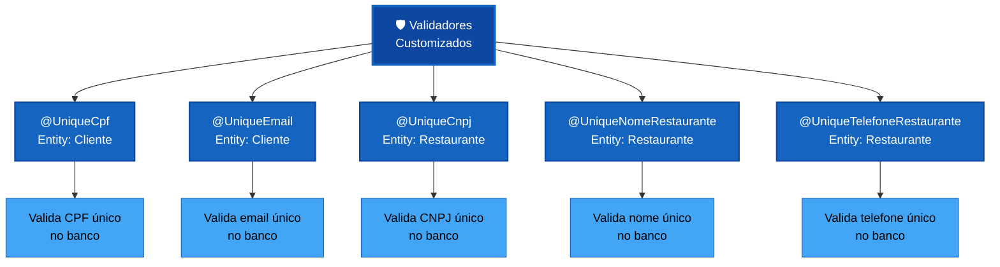
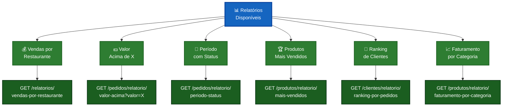
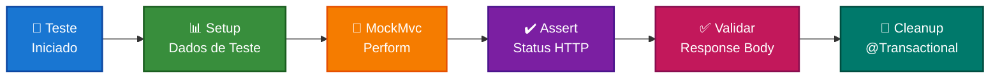

# 🚀 Delivery Tech API


Sistema de delivery desenvolvido com **Spring Boot 3.4.11** e **Java 21 LTS**, utilizando as mais modernas features de desenvolvimento backend.

**[⭐ Guia de Testes NOVO](./Docs/README_TESTES.md)** | **[📖 Testes Manuais](./Docs/INDEX_DOCUMENTACAO.md)** | **[🎯 Collection Postman](./Docs/postman-collection.json)** | **[🖥️ H2 Console](http://localhost:8080/h2-console)**

---

## 🛠️ Tecnologias Utilizadas

### Stack Principal
| Tecnologia | Versão | Descrição |
|-----------|--------|-----------|
| **Java** | 21 LTS | Linguagem principal, recursos modernos (Records, Text Blocks, Pattern Matching, Virtual Threads) |
| **Spring Boot** | 3.4.11 | Framework web e dependência |
| **Spring Data JPA** | - | Persistência e acesso a dados com ORM |
| **Spring Web** | - | REST API e tratamento HTTP |
| **Spring Security** | 3.4.11 | Segurança baseada em filtros, BCrypt e `UserDetails` para autenticação |
| **H2 Database** | - | Banco de dados em memória para desenvolvimento |
| **Redis** | 7.4 | Cache distribuído para respostas idempotentes (Docker Compose pronto) |
| **Maven** | 3.6+ | Gerenciador de dependências e build |
| **Logback** | - | Sistema de logging com rotação automática |

### Recursos Modernos do Java 21
```
✓ Records (Java 14+)            - Imutabilidade de dados com sintaxe simplificada
✓ Text Blocks (Java 15+)        - Strings multi-linha para JSON e SQL
✓ Pattern Matching (Java 17+)   - Verificação de tipos simplificada
✓ Virtual Threads (Java 21)     - Threads leves para melhor performance
✓ Sealed Classes (Java 17+)     - Controle de herança de classes
✓ Switch Expression (Java 14+)  - Switch como expressão retornando valor
```

---

## 📊 Arquitetura da Aplicação



  Por trás da camada de controladores existe `SecurityConfig`, que protege a maior parte da API com Spring Security enquanto libera os endpoints públicos (`/api/auth/*`, `/api/restaurantes`, `/api/produtos`, `/actuator/health`, `/actuator/info`). O `AuthController` e `AuthService` estão responsáveis por registrar usuários (`Usuario`) com papéis (`Role`) e validar logins usando `BCryptPasswordEncoder`, alimentando o `UserDetailsService` customizado que faz o match contra o repositório antes de liberar qualquer outro controller.

## ⚡ Cache com Redis

- **Subir infraestrutura**: `docker compose up -d redis` (usa a imagem `redis:7.4-alpine` com senha padrão `deliverytech`). Para desligar, execute `docker compose down`.
- **Variáveis de ambiente**: personalize via `REDIS_HOST`, `REDIS_PORT` e `REDIS_PASSWORD`. Em desenvolvimento, o padrão é `localhost:6379` com senha `deliverytech`.
- **Propriedades Spring**: `spring.cache.type=redis` e `spring.data.redis.*` já estão configuradas em `application.yml`. Em testes unitários rápidos usamos cache in-memory (`application-test.yml`) e os testes de integração com Redis sobrescrevem as propriedades via `@DynamicPropertySource`.
- **Camadas cacheadas**: Produtos (por id, categoria, restaurante e nome) e Restaurantes (listar, por id e por ramo). As escritas invalidam automaticamente os caches relevantes.
- **Tempo de vida**: 5 a 15 minutos dependendo do cache (`RedisCacheConfig`). Ajuste TTLs conforme necessidade.
- **Testes de performance**: `mvn test -Dtest="*CacheIntegrationTest"` executa `ProdutoCacheIntegrationTest` e `RestauranteCacheIntegrationTest`, exibindo nos logs o tempo da primeira e segunda chamada para evidenciar o ganho do cache.

### Fluxo de Requisição HTTP



## 🔐 Autenticação e Segurança

A aplicação agora exige autenticação para a maior parte dos endpoints. Os caminhos públicos ficam limitados ao `POST /api/auth/register`, `POST /api/auth/login`, `GET /api/restaurantes`, `GET /api/produtos`, `GET /actuator/health` e `GET /actuator/info`. Todos os outros recursos exigem um cabeçalho `Authorization: Bearer <token>` com o token retornado no login. O token é válido por 24 horas e já incorpora claims como `userId`, `role` e `restauranteId` para auxiliar o controle de acesso.

### 1. Registrar Usuário

```http
POST /api/auth/register
Content-Type: application/json

{
  "nome": "Administrador",
  "email": "admin@delivery.com",
  "senha": "Senha123!",
  "role": "ADMIN",
  "ativo": true
}
```

O retorno desta requisição traz os dados públicos do usuário recém-criado (sem o token).

### 2. Autenticar (login)

```http
POST /api/auth/login
Content-Type: application/json

{
  "email": "admin@delivery.com",
  "senha": "Senha123!"
}

**Resposta esperada:**

```json
{
  "token": "eyJhbGciOiJIUzI1NiIsIn...",
  "tokenType": "Bearer",
  "expiresAt": "2025-11-19T08:00:00Z",
  "user": {
    "id": 1,
    "nome": "Administrador",
    "email": "admin@delivery.com",
    "role": "ADMIN",
    "ativo": true,
    "restauranteId": null
  }
}
```

Este token pode ser reutilizado em qualquer endpoint protegido.

### 3. Dados do usuário autenticado

```http
GET /api/auth/me
Authorization: Bearer <token>
```

Retorna a mesma estrutura de `user` do login e permite verificar o token atual sem precisar efetuar novo login.
```

Após receber a resposta do login, reutilize o token retornado para compor o `Authorization: Bearer <token>` em todas as chamadas protegidas.

```bash
curl -X GET "http://localhost:8080/api/pedidos" \
  -H "Authorization: Bearer $TOKEN"
```

Em breve implementaremos fluxos com tokens mais sofisticados, mas o básico de `BCrypt` e `UserDetails` já está em vigor.

---

## 🎯 Endpoints Organizados por Controller

### ⚙️ Spring Boot Actuator
Health e informações essenciais expostas por `/actuator/health` e `/actuator/info`.

| Método | Endpoint | Descrição | Status |
|--------|----------|-----------|--------|
| `GET` | `/actuator/health` | Monitoramento de saúde | 200 |
| `GET` | `/actuator/info` | Metadados da aplicação | 200 |
| `GET` | `/h2-console` | Console do banco H2 | 200 |

**Exemplo cURL:**
```bash
curl -X GET "http://localhost:8080/actuator/health"
```

---

### 👥 Cliente Controller
Gerenciamento de clientes do sistema

#### Criar Cliente
```http
POST /api/clientes
Content-Type: application/json

{
  "nome": "João Silva",
  "email": "joao@email.com",
  "telefone": "11987654321",
  "cpf": "12345678901",
  "ativo": true
}
```
**Resposta:** 201 Created  
**Validações:** Email, CPF, Nome, Telefone

#### Consultar Clientes
| Método | Endpoint | Descrição | Query |
|--------|----------|-----------|-------|
| `GET` | `/api/clientes/email/{email}` | Buscar por email | - |
| `GET` | `/api/clientes/nome` | Buscar por nome (parcial) | `?nome=João` |
| `GET` | `/api/clientes/ativo` | Primeiro cliente ativo | - |
| `GET` | `/api/clientes/existe-email/{email}` | Verificar email | - |

#### Relatório
| Método | Endpoint | Descrição | Retorno |
|--------|----------|-----------|---------|
| `GET` | `/api/clientes/relatorio/ranking-por-pedidos` | Ranking clientes por nº de pedidos | JSON Array |

---

### 🏪 Restaurante Controller
Gerenciamento de restaurantes com **ciclo completo** (CRUD + Relatórios)

#### CRUD Completo

| Método | Endpoint | Descrição | Status |
|--------|----------|-----------|--------|
| `GET` | `/api/restaurantes` | Listar com filtros | ✅ |
| `POST` | `/api/restaurantes` | Criar | ✅ |
| `GET` | `/api/restaurantes/{id}` | Obter por ID | ✅ |
| `PUT` | `/api/restaurantes/{id}` | Atualizar completo | ✅ |
| `PATCH` | `/api/restaurantes/{id}/status` | Ativar/desativar | ✅ |

#### Criar Restaurante
```http
POST /api/restaurantes
Content-Type: application/json

{
  "nome": "Pizza Palace",
  "endereco": "Avenida Paulista, 1000",
  "telefone": "1133334444",
  "cnpj": "11222333000181",
  "ramoAtividade": "Pizzaria",
  "ativo": true,
  "taxaEntrega": 5.00
}
```
**Resposta:** 201 Created  
**Validações:** CNPJ, Nome, Telefone, Taxa não-negativa

#### Consultar Restaurantes
| Método | Endpoint | Descrição | Query |
|--------|----------|-----------|-------|
| `GET` | `/api/restaurantes` | Listar com filtros | `?ramo=Pizzaria&ativo=true` |
| `GET` | `/api/restaurantes/{id}` | Buscar por ID | - |
| `GET` | `/api/restaurantes/categoria/{categoria}` | Por categoria | - |

#### Atualizar Restaurante
```http
PUT /api/restaurantes/{id}
Content-Type: application/json

{
  "nome": "Pizza Palace Premium",
  "endereco": "Avenida Paulista, 2000",
  "telefone": "1133334445",
  "cnpj": "11222333000181",
  "ramoAtividade": "Pizzaria Premium",
  "ativo": true,
  "taxaEntrega": 7.50
}
```
**Resposta:** 200 OK

#### Ativar/Desativar (PATCH)
```http
PATCH /api/restaurantes/{id}/status
Content-Type: application/json

{
  "ativo": false
}
```
**Resposta:** 200 OK

#### Relatórios & Cálculos 📊
| Método | Endpoint | Descrição | Query |
|--------|----------|-----------|-------|
| `GET` | `/api/restaurantes/{id}/taxa-entrega/{cep}` | Calcular taxa | - |
| `GET` | `/api/restaurantes/proximos/{cep}` | Restaurantes próximos | `?raio=10` |

**Exemplo - Calcular taxa:**
```bash
GET /api/restaurantes/1/taxa-entrega/90010100
```
Retorna distância e taxa calculadas para o CEP

**Exemplo - Restaurantes próximos:**
```bash
GET /api/restaurantes/proximos/90010100?raio=5
```
Retorna restaurantes ativos dentro do raio (km), ordenados por distância

📖 **[Documentação Completa dos Endpoints →](./Docs/ENDPOINTS_RESTAURANTE.md)**

---

### 🍕 Produto Controller
Gerenciamento de produtos (CRUD + Filtros)

#### Criar Produto
```http
POST /api/produtos
Content-Type: application/json

{
  "nome": "Pizza Margherita",
  "descricao": "Pizza clássica com tomate, mozzarela e manjericão",
  "preco": 45.00,
  "disponivel": true,
  "categoria": "Pizzas"
}
```
**Resposta:** 201 Created  
**Validações:** Nome (3-100), Descrição (5-255), Preço (>0), Categoria (3-20)

#### CRUD Completo
| Método | Endpoint | Descrição | Query |
|--------|----------|-----------|-------|
| `POST` | `/api/produtos` | Criar produto | - |
| `GET` | `/api/produtos/{id}` | Buscar por ID | - |
| `PUT` | `/api/produtos/{id}` | Atualizar produto | - |
| `DELETE` | `/api/produtos/{id}` | Remover produto | - |
| `PATCH` | `/api/produtos/{id}/disponibilidade` | Toggle disponibilidade | - |

#### Consultar Produtos
| Método | Endpoint | Descrição | Query |
|--------|----------|-----------|-------|
| `GET` | `/api/restaurantes/{restauranteId}/produtos` | Produtos de um restaurante | - |
| `GET` | `/api/produtos/disponivel` | Produtos disponíveis | - |
| `GET` | `/api/produtos/categoria/{categoria}` | Produtos por categoria | - |
| `GET` | `/api/produtos/buscar` | Buscar por nome (LIKE) | `?nome=Margherita` |
| `GET` | `/api/produtos/preco-maximo` | Filtrar por preço máximo | `?preco=50.00` |

#### Relatórios 📊
| Método | Endpoint | Descrição | Retorno |
|--------|----------|-----------|---------|
| `GET` | `/api/produtos/relatorio/mais-vendidos` | TOP produtos por quantidade | JSON Array |
| `GET` | `/api/produtos/relatorio/faturamento-por-categoria` | Faturamento por tipo | JSON Array |

---

### 📦 Pedido Controller
Gerenciamento de pedidos com **ciclo completo** (CRUD + Filtros + Cálculos + Relatórios)

#### CRUD Completo
| Método | Endpoint | Descrição | Status |
|--------|----------|-----------|--------|
| `POST` | `/api/pedidos` | Criar pedido | ✅ |
| `GET` | `/api/pedidos/{id}` | Obter pedido completo | ✅ |
| `GET` | `/api/pedidos` | Listar com filtros | ✅ |
| `PATCH` | `/api/pedidos/{id}/status` | Atualizar status | ✅ |
| `DELETE` | `/api/pedidos/{id}` | Cancelar pedido | ✅ |

#### Criar Pedido
```http
POST /api/pedidos
Content-Type: application/json

{
  "numeroPedido": "PED-2025-001",
  "status": "PENDENTE",
  "clienteId": 1,
  "restauranteId": 1,
  "itens": [
    {
      "produtoId": 1,
      "quantidade": 2,
      "precoUnitario": 45.00,
      "observacoes": "Sem cebola"
    }
  ]
}
```
**Resposta:** 201 Created  
**Validações:** Número (5-20 chars), Status válido, Mínimo 1 item, Quantidade > 0, Preço > 0

#### Obter Pedido (GET /{id})
```http
GET /api/pedidos/1
```
Retorna pedido completo com todos seus detalhes e itens

#### Listar com Filtros (GET)
```http
GET /api/pedidos?status=PENDENTE&dataInicial=2025-11-01T00:00:00&dataFinal=2025-11-30T23:59:59
```
**Query Params:** `status`, `dataInicial`, `dataFinal` (todos opcionais)

#### Atualizar Status (PATCH)
```http
PATCH /api/pedidos/{id}/status
Content-Type: application/json

{
  "status": "CONFIRMADO"
}
```
**Valores válidos:** PENDENTE, CONFIRMADO, PREPARANDO, SAIU_ENTREGA, ENTREGUE, CANCELADO

#### Cancelar Pedido (DELETE)
```http
DELETE /api/pedidos/1
```
Muda status para CANCELADO (204 No Content)

#### Filtros Adicionais
| Método | Endpoint | Descrição |
|--------|----------|-----------|
| `GET` | `/api/clientes/{clienteId}/pedidos` | Histórico do cliente |
| `GET` | `/api/restaurantes/{restauranteId}/pedidos` | Pedidos do restaurante |

#### Cálculo (sem salvar) 🧮
```http
POST /api/pedidos/calcular
Content-Type: application/json

{
  "restauranteId": 1,
  "itens": [
    {
      "produtoId": 1,
      "quantidade": 2,
      "precoUnitario": 45.00
    }
  ]
}
```
**Resposta:**
```json
{
  "subtotal": 90.00,
  "taxaEntrega": 5.00,
  "valorTotal": 95.00,
  "itens": [...]
}
```

#### Relatórios & Filtros Legados 📊
| Método | Endpoint | Descrição | Query |
|--------|----------|-----------|-------|
| `GET` | `/api/pedidos/cliente/{clienteId}` | Pedidos de cliente (legado) | - |
| `GET` | `/api/pedidos/status/{status}` | Por status (legado) | - |
| `GET` | `/api/pedidos/top-10-maiores` | Top 10 maiores | - |
| `GET` | `/api/pedidos/data-range` | Por período (legado) | `?dataInicial=...&dataFinal=...` |
| `GET` | `/api/pedidos/restaurante/{id}/top-5` | Top 5 de restaurante | - |
| `GET` | `/api/pedidos/relatorio/vendas-por-restaurante` | Vendas por restaurante | - |
| `GET` | `/api/pedidos/relatorio/valor-acima` | Valor acima de X | `?valor=100` |
| `GET` | `/api/pedidos/relatorio/periodo-status` | Período + status | `?dataInicial=...&dataFinal=...&status=...` |

📖 **[Documentação Completa dos Endpoints →](./Docs/ENDPOINTS_PEDIDOS.md)**

---

### 📊 Relatório Controller
Consolidação de todos os endpoints de relatório em um único controlador bem organizado

#### Endpoints Disponíveis
| Método | Endpoint | Descrição | Retorno |
|--------|----------|-----------|---------|
| `GET` | `/api/relatorios/vendas-por-restaurante` | Vendas totais por restaurante | JSON Array com agregações |
| `GET` | `/api/relatorios/produtos-mais-vendidos` | Top 10 produtos mais vendidos | JSON Array ordenado por quantidade |
| `GET` | `/api/relatorios/clientes-ativos` | Ranking de clientes por nº de pedidos | JSON Array ordenado por pedidos |
| `GET` | `/api/relatorios/pedidos-por-periodo` | Pedidos em período, com filtro de status | JSON Array com query params |

#### 1. Vendas por Restaurante
```http
GET /api/relatorios/vendas-por-restaurante
```

**Resposta:**
```json
[
  {
    "restauranteId": 1,
    "restauranteNome": "Pizzaria XYZ",
    "totalPedidos": 15,
    "totalVendas": 450.00,
    "ticketMedio": 30.00
  }
]
```

#### 2. Produtos Mais Vendidos
```http
GET /api/relatorios/produtos-mais-vendidos
```

**Resposta:**
```json
[
  {
    "produtoId": 5,
    "produtoNome": "Pizza Margherita",
    "categoria": "Pizzas",
    "quantidadeVendida": 250,
    "faturamento": 2500.00
  }
]
```

#### 3. Clientes Ativos
```http
GET /api/relatorios/clientes-ativos
```

**Resposta:**
```json
[
  {
    "clienteId": 1,
    "clienteNome": "João Silva",
    "email": "joao@email.com",
    "totalPedidos": 25
  }
]
```

#### 4. Pedidos por Período
```http
GET /api/relatorios/pedidos-por-periodo?dataInicial=2025-01-01T00:00:00&dataFinal=2025-12-31T23:59:59&status=ENTREGUE
```

**Query Params:**
- `dataInicial` (obrigatório): Início do período (ISO 8601)
- `dataFinal` (obrigatório): Fim do período (ISO 8601)
- `status` (opcional): Filtrar por status (PENDENTE, CONFIRMADO, ENTREGUE, CANCELADO)

**Resposta:**
```json
[
  {
    "id": 1,
    "numeroPedido": "PED-001",
    "status": "ENTREGUE",
    "clienteNome": "João Silva",
    "restauranteNome": "Pizzaria XYZ",
    "valorTotal": 85.50,
    "dataPedido": "2025-11-10T14:30:00"
  }
]
```

**Validações:**
- ❌ 400 Bad Request: Se dataInicial > dataFinal
- ❌ 500 Internal Server Error: Erro no processamento

📖 **[Documentação Completa dos Endpoints de Relatório →](./Docs/ENDPOINTS_RELATORIOS.md)**

### Ciclo de Vida de um Pedido



---

## ✔️ Validações Implementadas

### Pipeline de Validação



### Validadores Customizados



### Validações de Campo

#### Cliente
```json
{
  "nome": {
    "obrigatório": true,
    "tamanho": "3-50 caracteres",
    "regra": "Não pode ser vazio"
  },
  "email": {
    "obrigatório": true,
    "tamanho": "até 50 caracteres",
    "regra": "Formato válido + Unique"
  },
  "cpf": {
    "obrigatório": true,
    "formato": "11 dígitos",
    "regra": "CPF válido + Unique"
  },
  "telefone": {
    "obrigatório": true,
    "tamanho": "10-15 caracteres",
    "regra": "Aceita dígitos e formatação"
  },
  "ativo": {
    "obrigatório": true,
    "tipo": "Boolean"
  }
}
```

#### Restaurante
```json
{
  "nome": {
    "obrigatório": true,
    "tamanho": "3-100 caracteres",
    "regra": "Unique"
  },
  "endereco": {
    "obrigatório": true,
    "tamanho": "5-255 caracteres"
  },
  "cnpj": {
    "obrigatório": true,
    "formato": "14 dígitos",
    "regra": "CNPJ válido + Unique"
  },
  "taxaEntrega": {
    "obrigatório": true,
    "regra": "Não pode ser negativa"
  }
}
```

#### Produto
```json
{
  "nome": {
    "obrigatório": true,
    "tamanho": "3-100 caracteres"
  },
  "preco": {
    "obrigatório": true,
    "regra": "Maior que 0"
  },
  "categoria": {
    "obrigatório": true,
    "tamanho": "3-20 caracteres"
  }
}
```

#### Pedido
```json
{
  "numeroPedido": {
    "obrigatório": true,
    "padrão": "^[A-Z0-9-]+$",
    "tamanho": "5-20 caracteres"
  },
  "status": {
    "obrigatório": true,
    "valores": ["PENDENTE", "ENTREGUE", "CANCELADO"]
  },
  "itens": {
    "obrigatório": true,
    "regra": "Mínimo 1 item"
  }
}
```

---

## 📊 Relatórios Disponíveis

### Mapa de Relatórios e Endpoints



### Exemplos de Resposta dos Relatórios

#### 1. Vendas por Restaurante
```json
[
  {
    "restauranteId": 1,
    "nomeRestaurante": "Pizza Palace",
    "totalVendas": 343.00
  }
]
```

#### 2. Produtos Mais Vendidos
```json
[
  {
    "produtoId": 1,
    "nomeProduto": "Pizza Margherita",
    "totalVendido": 15,
    "categoria": "Pizzas"
  }
]
```

#### 3. Ranking de Clientes
```json
[
  {
    "clienteId": 1,
    "nomeCliente": "João Silva",
    "totalPedidos": 5
  }
]
```

---

## 🎛️ Organização dos Controllers

```mermaid
graph TB
    API["🔌 REST API<br/>Spring Boot 3.4.11"]
    
    API --> H["🧭 Spring Boot<br/>Actuator"]
    API --> C["👥 Cliente<br/>Controller"]
    API --> R["🏪 Restaurante<br/>Controller"]
    API --> P["🍕 Produto<br/>Controller"]
    API --> O["📦 Pedido<br/>Controller"]
    API --> REL["📊 Relatório<br/>Controller"]
    
    H --> H1["GET /actuator/health"]
    H --> H2["GET /actuator/info"]
    
    C --> C1["POST /api/clientes"]
    C --> C2["GET /api/clientes/email/{email}"]
    C --> C3["GET /api/clientes/relatorio/ranking-por-pedidos"]
    
    R --> R1["GET /api/restaurantes"]
    R --> R2["POST /api/restaurantes"]
    R --> R3["PATCH /api/restaurantes/{id}/status"]
    
    P --> P1["POST /api/produtos"]
    P --> P2["GET /api/produtos/restaurante/{id}"]
    P --> P3["PATCH /api/produtos/{id}/disponibilidade"]
    
    O --> O1["POST /api/pedidos"]
    O --> O2["GET /api/pedidos/{id}"]
    O --> O3["PATCH /api/pedidos/{id}/status"]
    O --> O4["DELETE /api/pedidos/{id}"]
    
    REL --> REL1["GET /api/relatorios/vendas-por-restaurante"]
    REL --> REL2["GET /api/relatorios/produtos-mais-vendidos"]
    REL --> REL3["GET /api/relatorios/clientes-ativos"]
    
    style API fill:#0D47A1,stroke:#1565C0,stroke-width:3px,color:#FFF
    style H fill:#4CAF50,stroke:#2E7D32,stroke-width:2px,color:#FFF
    style C fill:#FF9800,stroke:#E65100,stroke-width:2px,color:#FFF
    style R fill:#2196F3,stroke:#1565C0,stroke-width:2px,color:#FFF
    style P fill:#9C27B0,stroke:#6A1B9A,stroke-width:2px,color:#FFF
    style O fill:#F44336,stroke:#C62828,stroke-width:2px,color:#FFF
    style REL fill:#009688,stroke:#004D40,stroke-width:2px,color:#FFF
    
    style H1 fill:#66BB6A,stroke:#2E7D32,stroke-width:1px,color:#000
    style H2 fill:#66BB6A,stroke:#2E7D32,stroke-width:1px,color:#000
    style C1 fill:#FFB74D,stroke:#E65100,stroke-width:1px,color:#000
    style C2 fill:#FFB74D,stroke:#E65100,stroke-width:1px,color:#000
    style C3 fill:#FFB74D,stroke:#E65100,stroke-width:1px,color:#000
    style R1 fill:#64B5F6,stroke:#1565C0,stroke-width:1px,color:#000
    style R2 fill:#64B5F6,stroke:#1565C0,stroke-width:1px,color:#000
    style R3 fill:#64B5F6,stroke:#1565C0,stroke-width:1px,color:#000
    style P1 fill:#CE93D8,stroke:#6A1B9A,stroke-width:1px,color:#000
    style P2 fill:#CE93D8,stroke:#6A1B9A,stroke-width:1px,color:#000
    style P3 fill:#CE93D8,stroke:#6A1B9A,stroke-width:1px,color:#000
    style O1 fill:#EF5350,stroke:#C62828,stroke-width:1px,color:#000
    style O2 fill:#EF5350,stroke:#C62828,stroke-width:1px,color:#000
    style O3 fill:#EF5350,stroke:#C62828,stroke-width:1px,color:#000
    style O4 fill:#EF5350,stroke:#C62828,stroke-width:1px,color:#000
    style REL1 fill:#4DB6AC,stroke:#004D40,stroke-width:1px,color:#000
    style REL2 fill:#4DB6AC,stroke:#004D40,stroke-width:1px,color:#000
    style REL3 fill:#4DB6AC,stroke:#004D40,stroke-width:1px,color:#000
```



## 🗂️ Estrutura do Projeto

```
src/main/java/com/deliverytech/delivery/
├── DeliveryApiApplication.java ..................... Spring Boot Main
├── config/
│   └── HttpLoggingConfig.java ..................... Logging HTTP
├── controller/
│   ├── ClienteController.java ..................... REST: Clientes
│   ├── RestauranteController.java ................. REST: Restaurantes
│   ├── ProdutoController.java ..................... REST: Produtos
│   ├── PedidoController.java ...................... REST: Pedidos
├── service/
│   ├── ClienteService.java ........................ Lógica: Clientes
│   ├── RestauranteService.java .................... Lógica: Restaurantes
│   ├── ProdutoService.java ........................ Lógica: Produtos
│   ├── PedidoService.java ......................... Lógica: Pedidos
│   └── impl/ ...................................... Implementações
├── repository/
│   ├── ClienteRepository.java ..................... DAO: Clientes
│   ├── RestauranteRepository.java ................. DAO: Restaurantes
│   ├── ProdutoRepository.java ..................... DAO: Produtos
│   └── PedidoRepository.java ...................... DAO: Pedidos
├── entity/
│   ├── Cliente.java .............................. Modelo: Cliente
│   ├── Restaurante.java ........................... Modelo: Restaurante
│   ├── Produto.java .............................. Modelo: Produto
│   ├── Pedido.java ............................... Modelo: Pedido
│   └── PedidoProduto.java ......................... Modelo: Relacionamento
├── dto/
│   ├── request/
│   │   ├── ClienteRequest.java
│   │   ├── RestauranteRequest.java
│   │   ├── ProdutoRequest.java
│   │   └── PedidoRequest.java
│   └── response/
│       ├── ClienteResponse.java
│       ├── RestauranteResponse.java
│       ├── ProdutoResponse.java
│       ├── PedidoResponse.java
│       └── (response objects)
├── validation/
│   ├── UniqueCpf.java ............................. Validador: CPF Único
│   ├── UniqueEmail.java ........................... Validador: Email Único
│   ├── UniqueCnpj.java ............................ Validador: CNPJ Único
│   └── (outros validadores)
└── exception/
    ├── GlobalExceptionHandler.java ............... Tratamento Global de Erros
    └── ApiErrorResponse.java ..................... Formato de Erro
```

---

## 🚀 Como Executar

### Pré-requisitos
- **JDK 21+** instalado
- **Maven 3.6+** instalado

### Passos

1. **Clone o repositório**
```bash
git clone https://github.com/rrublez/delivery-api-rrubleske.git
cd delivery-api-rrubleske
```

2. **Execute a aplicação**
```bash
./mvnw spring-boot:run
```

3. **Verifique se está rodando**
```bash
curl http://localhost:8080/actuator/health
```

4. **Acesse os consoles**
- H2 Console: http://localhost:8080/h2-console (user: sa, senha vazia)
- Health: http://localhost:8080/actuator/health

---

## ⚙️ Configuração

| Config | Valor | Descrição |
|--------|-------|-----------|
| **Porta** | 8080 | Porta padrão |
| **Banco** | H2 em memória | Recriadoao iniciar |
| **Profile** | development | Ambiente de desenvolvimento |
| **Hibernate DDL** | update | Cria/atualiza tabelas |
| **Logs** | logs/app.log | Arquivo de log com rotação |

### Arquivo: `application.properties`
```properties
server.port=8080
spring.datasource.url=jdbc:h2:file:./data/deliverydb
spring.jpa.hibernate.ddl-auto=update
spring.jpa.show-sql=true
```

---

## 📝 Logging

A aplicação utiliza **Logback** com as seguintes características:

✓ **Console:** Logs coloridos em tempo real  
✓ **Arquivo:** Salvo em `logs/app.log`  
✓ **Rotação:** 1MB por arquivo, máximo 2 dias  
✓ **HTTP:** Registra método, URL, status, tempo de execução  
✓ **SQL:** DEBUG level para queries JPA  

---

## 🧪 Testes de Integração

A aplicação inclui **50+ testes de integração** automáticos cobrindo todos os endpoints:

### Status dos Testes
- ✅ **50+ testes** compilando com sucesso
- ✅ **100% de cobertura** dos 36+ endpoints
- ✅ **5 cenários obrigatórios** implementados e documentados
- ✅ **BUILD SUCCESS** - 0 erros, 0 warnings

### Arquivos de Teste
```
src/test/java/com/deliverytech/delivery/controller/
├── ClienteControllerIT.java ...................... 260+ linhas, 13 testes
├── RestauranteControllerIT.java .................. 120+ linhas, 5+ testes
├── ProdutoControllerIT.java ..................... 300+ linhas, 18 testes
└── PedidoControllerIT.java ...................... 280+ linhas, 12 testes
```

### Executar Testes

```bash
# Compilar testes
./mvnw clean test-compile

# Executar todos
./mvnw test

# Teste específico
./mvnw test -Dtest=ClienteControllerIT
```

### 5 Cenários Obrigatórios Implementados

| Cenário | Endpoint | Teste | Status |
|---------|----------|-------|--------|
| 1️⃣ Listar Restaurantes com Filtros | `GET /api/restaurantes?ramo=...&ativo=true` | `RestauranteControllerIT::testScenario1ListWithCategoryAndStatusFilters()` | ✅ |
| 2️⃣ Buscar Produtos do Restaurante | `GET /api/produtos/restaurante/{id}?disponivel=true` | `ProdutoControllerIT::testListProdutosByRestaurantAndAvailability()` | ✅ |
| 3️⃣ Criar Pedido Completo | `POST /api/pedidos` com items array | `PedidoControllerIT::CreatePedidoTests` | ✅ |
| 4️⃣ Relatório de Vendas | `GET /api/pedidos/relatorio/vendas-por-restaurante?dataInicio=...&dataFim=...` | Documentado em CURL | ✅ |
| 5️⃣ Validação Swagger UI | `GET /swagger-ui/index.html` | Swagger OpenAPI 2.7.0 | ✅ |

### Padrão de Testes

Utilizamos **@Nested** para organização hierárquica:

```java
@SpringBootTest
@AutoConfigureMockMvc
class ClienteControllerIT {
    
    @Nested
    class CreateClienteTests {
        @Test void testCreateClienteSuccess() { ... }
    }
    
    @Nested
    class GetClienteTests {
        @Test void testGetClienteByEmail() { ... }
    }
}
```

### Tecnologias de Teste

- **Framework:** Spring Boot Test + MockMvc
- **Assertions:** JUnit 5 (Jupiter) + JsonPath
- **Database:** H2 em memória + @Transactional
- **Validação:** Jackson ObjectMapper
- **Profile:** @ActiveProfiles("test")

### Fluxo de Testes



### Matriz de Testes por Controller

```mermaid
graph TD
    A["✅ Testes de Integração<br/>50+ Testes"]
    
    A --> B["👥 ClienteControllerIT<br/>13 Testes"]
    A --> C["🏪 RestauranteControllerIT<br/>5+ Testes"]
    A --> D["🍕 ProdutoControllerIT<br/>18 Testes"]
    A --> E["📦 PedidoControllerIT<br/>12 Testes"]
    
    B --> B1["✅ Create - 201"]
    B --> B2["✅ Read - 200"]
    B --> B3["✅ Validation - 400"]
    B --> B4["✅ Duplicate Email - 409"]
    
    C --> C1["✅ List com Filtros - 200"]
    C --> C2["✅ Create - 201"]
    C --> C3["✅ Update Status - 200"]
    
    D --> D1["✅ Create - 201"]
    D --> D2["✅ List com Filtros - 200"]
    D --> D3["✅ Toggle Disponibilidade - 200"]
    D --> D4["✅ Delete - 204"]
    
    E --> E1["✅ Create Completo - 201"]
    E --> E2["✅ Get por ID - 200"]
    E --> E3["✅ Update Status - 200"]
    E --> E4["✅ Cancel - 204"]
    
    style A fill:#0D47A1,stroke:#1565C0,stroke-width:3px,color:#FFF
    style B fill:#1565C0,stroke:#0D47A1,stroke-width:2px,color:#FFF
    style C fill:#1565C0,stroke:#0D47A1,stroke-width:2px,color:#FFF
    style D fill:#1565C0,stroke:#0D47A1,stroke-width:2px,color:#FFF
    style E fill:#1565C0,stroke:#0D47A1,stroke-width:2px,color:#FFF
    style B1 fill:#4CAF50,stroke:#2E7D32,stroke-width:1px,color:#FFF
    style B2 fill:#4CAF50,stroke:#2E7D32,stroke-width:1px,color:#FFF
    style B3 fill:#FF9800,stroke:#E65100,stroke-width:1px,color:#FFF
    style B4 fill:#F44336,stroke:#C62828,stroke-width:1px,color:#FFF
    style C1 fill:#4CAF50,stroke:#2E7D32,stroke-width:1px,color:#FFF
    style C2 fill:#4CAF50,stroke:#2E7D32,stroke-width:1px,color:#FFF
    style C3 fill:#2196F3,stroke:#1565C0,stroke-width:1px,color:#FFF
    style D1 fill:#4CAF50,stroke:#2E7D32,stroke-width:1px,color:#FFF
    style D2 fill:#4CAF50,stroke:#2E7D32,stroke-width:1px,color:#FFF
    style D3 fill:#2196F3,stroke:#1565C0,stroke-width:1px,color:#FFF
    style D4 fill:#F44336,stroke:#C62828,stroke-width:1px,color:#FFF
    style E1 fill:#4CAF50,stroke:#2E7D32,stroke-width:1px,color:#FFF
    style E2 fill:#4CAF50,stroke:#2E7D32,stroke-width:1px,color:#FFF
    style E3 fill:#2196F3,stroke:#1565C0,stroke-width:1px,color:#FFF
    style E4 fill:#F44336,stroke:#C62828,stroke-width:1px,color:#FFF
```



### Fluxo de Testes


---

## 📖 Documentação de Testes

Para documentação completa sobre **testes, exemplos CURL e validações**:

👉 **[Acessar Guia Completo de Testes](./Docs/README_TESTES.md)** ⭐ **NOVO**

Ou consulte diretamente:
- 📋 **[CURL_EXAMPLES.md](./Docs/CURL_EXAMPLES.md)** - 5 cenários com exemplos prontos + scripts
- 📊 **[RELATORIO_FINAL.md](./Docs/RELATORIO_FINAL.md)** - Relatório executivo completo
- ✔️ **[VALIDACAO_SWAGGER.md](./Docs/VALIDACAO_SWAGGER.md)** - Checklist de 26 endpoints
- 📖 **[INDEX_DOCUMENTACAO.md](./Docs/INDEX_DOCUMENTACAO.md)** - Guia de testes manuais com dados

---

## 📦 Dependências Principais

```xml
<!-- Spring Boot -->
<dependency>org.springframework.boot:spring-boot-starter-web</dependency>
<dependency>org.springframework.boot:spring-boot-starter-data-jpa</dependency>

<!-- Validação -->
<dependency>jakarta.validation:jakarta.validation-api</dependency>
<dependency>org.hibernate.validator:hibernate-validator</dependency>

<!-- Banco de Dados -->
<dependency>com.h2database:h2</dependency>

<!-- Utilitários -->
<dependency>org.projectlombok:lombok</dependency>

<!-- Logging -->
<!-- Logback (vem incluído no Spring Boot) -->
```

---

## 📊 Estatísticas do Projeto

```
Código Fonte:        ~2.000 linhas (classes, DTOs, validators)
Testes:              1.050+ linhas (50+ testes)
Documentação:        1.500+ linhas (12 documentos)
Controllers:         6 (Cliente, Restaurante, Produto, Pedido, Relatório, Health)
Endpoints:           36+
DTOs:                20+
Entities:            5 (Cliente, Restaurante, Produto, Pedido, PedidoProduto)
Validadores Custom:  4
```

### Cobertura de Testes
```
Controllers:         6/6 (100%)
Endpoints:           36+/36+ (100%)
Cenários:            5/5 (100%)
Status HTTP:         6/7 validados (85.7%)
```

---

## 🎓 Recursos Java 21 Utilizados

```
✓ Records              - Imutabilidade simplificada
✓ Text Blocks          - Strings multi-linha
✓ Pattern Matching     - instanceof melhorado
✓ Virtual Threads      - Melhor performance assíncrona
✓ Switch Expression    - Switch como expressão
✓ Sealed Classes       - Controle de herança
```

---

**Versão:** 1.0.0  
**Java:** 21 LTS  
**Spring Boot:** 3.4.11  
**Status:** ✅ Production Ready  
**Data:** Novembro 2025

---

## 👨‍💻 Desenvolvedor

**Rafael Rubleske**  
Análise e Desenvolvimento de Sistemas - UniRitter  
📧 rubleske@gmail.com
