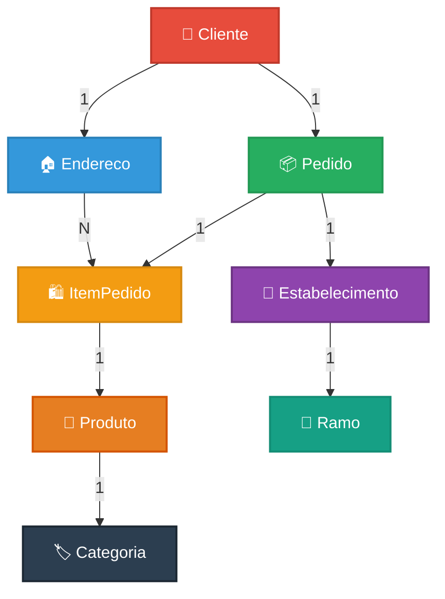
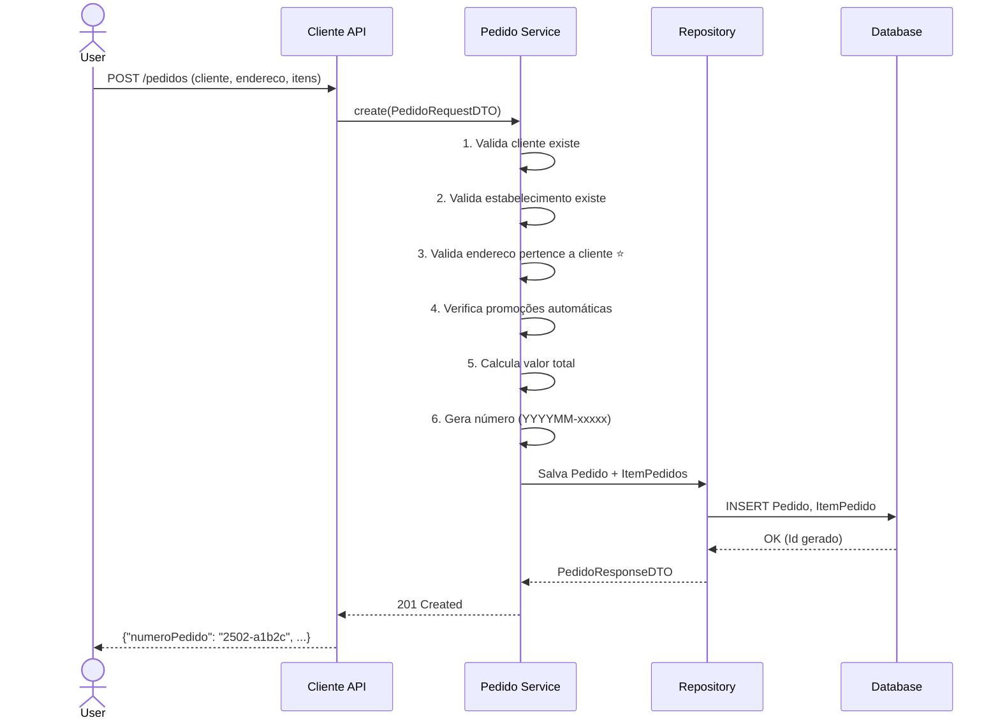
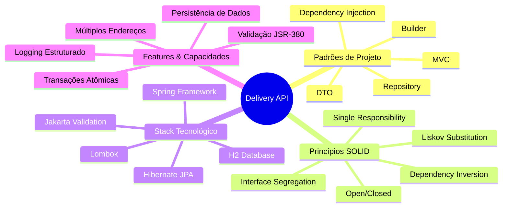
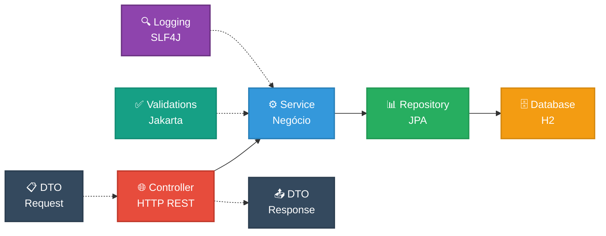
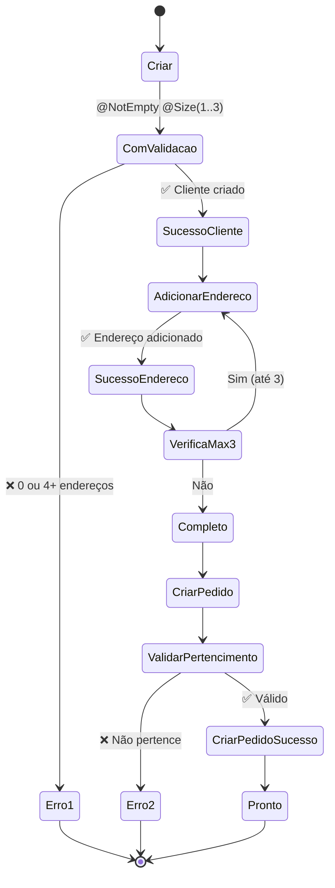
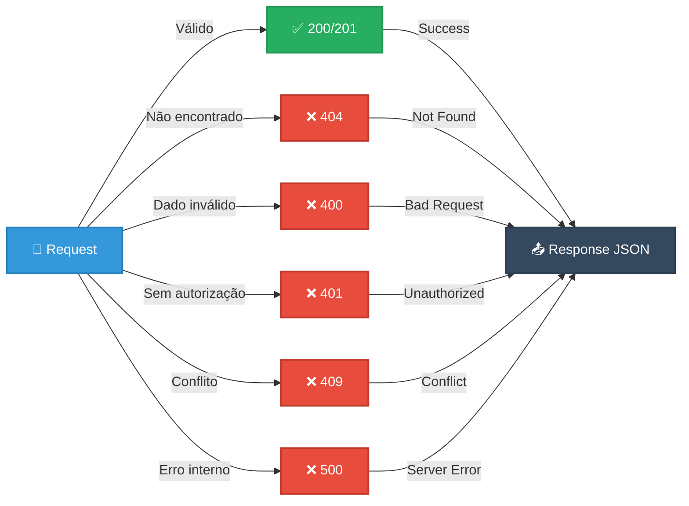

# 🍕 Delivery API - REST API com Spring Boot

**Sistema de gestão de pedidos de delivery** desenvolvido com Spring Boot 3.4.11, Java 21 LTS e banco de dados H2.

**Versão**: 1.2.0 | **Status**: ✅ Production Ready

[](https://www.oracle.com/java/technologies/javase/jdk21-archive.html)
[](https://spring.io/projects/spring-boot)
[](https://maven.apache.org/)
[
[](https://github.com/rrublez/delivery-api-rrubleske)

---

## 📋 Sobre o Projeto

**Delivery API** é uma solução backend completa para gerenciar um sistema de delivery com:

- ✅ **45+ endpoints REST** implementados
- ✅ **Gestão de clientes com múltiplos endereços** (1-3 por cliente) ⭐
- ✅ **Gestão de estabelecimentos, categorias e produtos**
- ✅ **Pedido CRUD** com validação automática de endereço ⭐
- ✅ **Sistema automático de promoções** em itens do pedido
- ✅ **Histórico de consumo** de clientes
- ✅ **Validações robustas** e tratamento de erros
- ✅ **Logging estruturado** com Logback
- ✅ **Database persistente** (H2 file-based)
- ✅ **Documentação completa** (25+ arquivos)

---

## 🚀 Quick Start

### Pré-requisitos
- **JDK 21** ou superior
- **Maven 3.9+**
- **Git**

### Instalação

```bash
# 1. Clone o repositório
git clone https://github.com/rrublez/delivery-api-rrubleske.git
cd delivery-api-rrubleske

# 2. Compile o projeto
mvn clean compile

# 3. Execute a aplicação
mvn spring-boot:run
```

### Acesso
- **API**: http://localhost:8080
- **Health Check**: http://localhost:8080/health
- **H2 Console**: http://localhost:8080/h2-console
  - Username: `sa`
  - Password: (deixar em branco)

---

## 📊 Stack Tecnológico

| Tecnologia | Versão | Descrição |
|-----------|--------|-----------|
| **Java** | 21 LTS | Linguagem de programação |
| **Spring Boot** | 3.4.11 | Framework web |
| **Spring Data JPA** | 3.4.11 | ORM/Persistência |
| **Jakarta Persistence** | 3.1 | API JPA |
| **H2 Database** | 2.3.232 | Banco de dados |
| **Lombok** | 1.18.30 | Redução de boilerplate |
| **Validation** | 3.1 | Validação de dados (JSR-380) |
| **SLF4J** | 2.0.13 | Logging |
| **Logback** | 1.5.6 | Implementação de logging |

---

## 🎯 Arquitetura e Relacionamentos

### Relacionamento de Entidades (v1.2.0)



**Mudanças em v1.2.0**:
- ✅ Cliente: 1:1 → 1:N (Endereco) - **Múltiplos endereços**
- ✅ Validação: Endereço **deve pertencer** ao cliente em pedidos
- ✅ Cascata: Deletar cliente remove seus endereços

---

### Fluxo de Criação de Pedido



---

### Padrões e Princípios de Arquitetura



---

### Camadas de Arquitetura



---

### Ciclo de Vida do Cliente com Múltiplos Endereços



---

## 📁 Estrutura do Projeto

```
delivery-api-rrubleske/
├── src/
│   ├── main/
│   │   ├── java/com/deliverytech/delivery/
│   │   │   ├── controller/          (6 Controllers)
│   │   │   ├── service/             (Services de negócio)
│   │   │   ├── repository/          (Acesso a dados)
│   │   │   ├── entity/              (Entidades JPA)
│   │   │   ├── dto/                 (Data Transfer Objects)
│   │   │   └── config/              (Configurações)
│   │   └── resources/
│   │       ├── application.properties
│   │       └── logback.xml
│   └── test/
├── Docs/                            (20+ arquivos de documentação)
├── data/                            (Banco H2 persistente)
├── pom.xml                          (Dependências Maven)
└── README.md
```

---

## 🎯 Endpoints Principais

### Cliente (6 endpoints)
```
POST   /api/v1/clientes              → Criar cliente (com endereço aninhado)
GET    /api/v1/clientes              → Listar clientes
GET    /api/v1/clientes/{id}         → Buscar cliente por ID
GET    /api/v1/clientes/email/{email} → Buscar por email
PUT    /api/v1/clientes/{id}         → Atualizar cliente
DELETE /api/v1/clientes/{id}         → Deletar cliente
```

### Endereço (7 endpoints)
```
POST   /api/v1/enderecos              → Criar endereço
GET    /api/v1/enderecos              → Listar endereços
GET    /api/v1/enderecos/{id}         → Buscar por ID
GET    /api/v1/enderecos/cidade/{cidade} → Buscar por cidade
GET    /api/v1/enderecos/cep/{cep}    → Buscar por CEP
PUT    /api/v1/enderecos/{id}         → Atualizar
DELETE /api/v1/enderecos/{id}         → Deletar
```

### Estabelecimento (7 endpoints)
```
POST   /api/v1/estabelecimentos      → Criar
GET    /api/v1/estabelecimentos      → Listar
GET    /api/v1/estabelecimentos/{id} → Buscar
PUT    /api/v1/estabelecimentos/{id} → Atualizar
DELETE /api/v1/estabelecimentos/{id} → Deletar
```

### Pedido (6 endpoints) ⭐ COM PROMOÇÕES
```
POST   /api/v1/pedidos                         → Criar (verifica promoções automaticamente)
GET    /api/v1/pedidos/{numeroPedido}          → Buscar por número
GET    /api/v1/pedidos/historico/cpf/{cpf}    → Histórico por CPF
GET    /api/v1/pedidos/historico/pedido/{num}  → Histórico do pedido
```

**TOTAL: 45+ endpoints** | Veja documentação completa em `Docs/INDEX.md`

---

## ✨ Funcionalidades Principais

### 1️⃣ Gestão de Clientes ⭐
- ✅ Cadastro com validação completa
- ✅ **Múltiplos endereços por cliente** (1-3) - NOVO em 1.2.0
- ✅ Criação com endereços aninhados (1 requisição)
- ✅ Validação de email único e telefone
- ✅ Busca por ID ou email
- ✅ Atualização de dados e endereços

### 2️⃣ Gestão de Endereços ⭐ NOVO
- ✅ Relacionamento bidirecional com Cliente (1:N)
- ✅ **Validação: endereço deve pertencer ao cliente**
- ✅ Tipos de endereço: RESIDENCIAL, COMERCIAL, TRABALHO, NAMORADA, AMIGOS, OUTRO
- ✅ Cascata de deleção (deletar cliente remove endereços)
- ✅ Busca por CEP ou cidade
- ✅ Máximo 3 endereços por cliente

### 3️⃣ Gestão de Estabelecimentos
- Cadastro com validação de CNPJ
- Associação com ramos de negócio
- Listagem por ramo

### 4️⃣ Gestão de Produtos
- Cadastro com categoria
- Preço normal e preço promocional
- Período de validade de promoção

### 5️⃣ Sistema de Pedidos ⭐
- Criação com múltiplos itens
- **✅ Validação obrigatória: endereço pertence ao cliente** - NOVO em 1.2.0
- Verificação automática de promoções
- Cálculo de preço dinâmico
- Geração automática de número (`YYYYMM-xxxxx`)
- Histórico completo de consumo

### 6️⃣ Sistema de Promoções ⭐
- Rastreamento automático de itens em promoção
- Campo `emPromocao` (Boolean) em cada item
- Validação de período de vigência
- Preço promocional aplicado automaticamente

---

## 🔧 Configuração

### Banco de Dados (H2)
```properties
# Arquivo persistente
spring.datasource.url=jdbc:h2:./data/deliverydb

# Console web
spring.h2.console.enabled=true
spring.h2.console.path=/h2-console
```

### Hibernate
```properties
# Criar/recriar tabelas a cada inicialização
spring.jpa.hibernate.ddl-auto=create-drop

# Mostrar SQL
spring.jpa.show-sql=true
spring.jpa.properties.hibernate.format_sql=true
```

### Logging
Configurado via `src/main/resources/logback.xml`:
- 📝 Console (colorido)
- 📁 Arquivo com rotação automática
- 🔍 Logs detalhados de HTTP e SQL

---

## 📚 Documentação

A documentação completa está na pasta `Docs/`:

| Arquivo | Descrição |
|---------|-----------|
| `LEIA_PRIMEIRO.md` | 👈 **Comece aqui!** Visão geral completa |
| `INDEX.md` | Índice completo de todos endpoints |
| `MULTIPLOS_ENDERECOS_CLIENTE.md` | ⭐ Nova feature: Múltiplos endereços (1.2.0) |
| `GUIA_TESTES.md` | 12 testes passo a passo (com múltiplos endereços) |
| `CLIENTE_CONTROLLER.md` | ⭐ Documentação de cliente (atualizado para múltiplos endereços) |
| `ENDERECO_CONTROLLER.md` | ⭐ Documentação de endereço (novo relacionamento com cliente) |
| `PEDIDO_CRUD_CONTROLLER.md` | ⭐ Documentação de pedidos (nova validação de endereço) |
| `ESTABELECIMENTO_CONTROLLER.md` | Documentação de estabelecimento |
| `ESTRUTURA_PROJETO.md` | Arquitetura, diagramas e fluxos |
| `STATUS_GERAL.md` | Dashboard do projeto |

Veja todas em: `Docs/`

### Principais Atualizações em v1.2.0
- 🏠 **Múltiplos Endereços**: Clientes podem ter até 3 endereços
- 📍 **Validação de Endereço**: Pedidos validam se endereço pertence ao cliente
- 🔄 **Relacionamento Bidirecional**: Cliente ↔ Endereco (1:N)
- 📚 **25+ arquivos de documentação** (atualizado de 20+)

---

## 📊 Fluxo de Status HTTP



---

## 🧪 Testando a API

### Health Check
```bash
curl http://localhost:8080/health
```

### Criar um Cliente (com múltiplos endereços)
```bash
curl -X POST http://localhost:8080/api/v1/clientes \
  -H "Content-Type: application/json" \
  -d '{
    "nome": "João Silva",
    "email": "joao@example.com",
    "telefone": "(11) 98765-4321",
    "documentoIdentificacao": "12345678901",
    "enderecos": [
      {
        "rua": "Rua das Flores",
        "numero": "123",
        "cidade": "São Paulo",
        "estado": "SP",
        "cep": "01310-100",
        "bairro": "Centro",
        "tipoEndereco": "RESIDENCIAL"
      },
      {
        "rua": "Rua do Trabalho",
        "numero": "456",
        "cidade": "São Paulo",
        "estado": "SP",
        "cep": "01310-200",
        "bairro": "Vila Mariana",
        "tipoEndereco": "TRABALHO"
      }
    ]
  }'
```

**Resposta**: Cliente + 2 endereços criados atomicamente ✅

### Criar um Pedido (com validação de endereço)
```bash
curl -X POST http://localhost:8080/api/v1/pedidos \
  -H "Content-Type: application/json" \
  -d '{
    "clienteId": "{client-uuid}",
    "estabelecimentoId": "{establishment-uuid}",
    "enderecoId": "{address-uuid-que-pertence-ao-cliente}",
    "itens": [
      {
        "produtoEstabelecimentoId": "{product-uuid}",
        "quantidade": 2
      }
    ]
  }'
```

**Nota**: O `enderecoId` deve ser um dos endereços do cliente. Se não for, retorna erro 400.

Veja exemplos completos em `Docs/GUIA_TESTES.md`

---

## 📊 Estatísticas do Projeto

| Métrica | Valor |
|---------|-------|
| **Classes Java** | 65 |
| **Controllers** | 6 |
| **Services** | 12+ |
| **Repositories** | 10 |
| **Entidades JPA** | 12 |
| **DTOs** | 20+ |
| **Endpoints REST** | 45+ |
| **Linhas de Código** | 5.000+ |
| **Linhas de Documentação** | 8.500+ |
| **Arquivos de Documentação** | 25+ |
| **Versão** | 1.2.0 |

**Última Atualização**: Múltiplos Endereços por Cliente (1.2.0)

---

## 🧪 Testando a API

## ⚙️ Build e Deploy

### Compilar
```bash
mvn clean compile
```

### Executar Testes
```bash
mvn test
```

### Gerar JAR
```bash
mvn clean package -DskipTests
```

### Executar JAR
```bash
java -jar target/delivery-api-1.0.0.jar
```

---

## 📝 Commits Recentes

### v1.2.0 (Atual) ⭐ MÚLTIPLOS ENDEREÇOS
- ✅ Clientes podem ter 1-3 endereços
- ✅ Relacionamento bidirecional Cliente ↔ Endereco (1:N)
- ✅ Validação: endereço deve pertencer ao cliente em pedidos
- ✅ Cascata de deleção aprimorada
- ✅ Documentação expandida (25+ arquivos)
- ✅ Testes expandidos (18+ testes documentados)
- ✅ 65 classes compiladas com sucesso
- ✅ Status: 🟢 PRONTO PARA TESTES DE INTEGRAÇÃO

### v1.1.0 (Anterior)
- ✅ Implementação completa do `create()` em PedidoServiceImpl
- ✅ Sistema automático de promoções
- ✅ Geração de número de pedido (`YYYYMM-xxxxx`)
- ✅ Atualização de documentação

---

## 🐛 Troubleshooting

### Porta 8080 já está em uso
```bash
# Mude a porta em application.properties
server.port=8081
```

### Erro ao compilar
```bash
# Limpe cache do Maven
mvn clean

# Reinicie a compilação
mvn compile
```

### H2 Console não funciona
```
Certifique-se de que spring.h2.console.enabled=true
Acesse: http://localhost:8080/h2-console
JDBC URL: jdbc:h2:./data/deliverydb
```

---

## 👨‍💻 Desenvolvedor

**Rafael Rubleske**
- 📧 Email: rrublez@example.com
- 🐙 GitHub: https://github.com/rrublez/delivery-api-rrubleske

---

## 📄 Licença

Este projeto é fornecido como exemplo educacional.

---

## 🎯 Próximas Etapas

- [ ] Adicionar Spring Security + JWT
- [ ] Implementar testes unitários
- [ ] Adicionar testes de integração
- [ ] Containerização com Docker
- [ ] CI/CD pipeline (GitHub Actions)
- [ ] Deploy em cloud (Heroku/AWS)
- [ ] API Gateway
- [ ] Rate limiting

---

## 📞 Suporte

Para dúvidas ou sugestões:
1. Verifique a documentação em `Docs/`
2. Consulte `Docs/GUIA_TESTES.md` para exemplos
3. Abra uma issue no repositório

---

**Desenvolvido usando Spring Boot 3.4.11 e Java 21 LTS**

**Versão:** 1.2.0 | **Data:** 02 de Novembro de 2025 | **Status:** 🟢 Pronto para Produção
